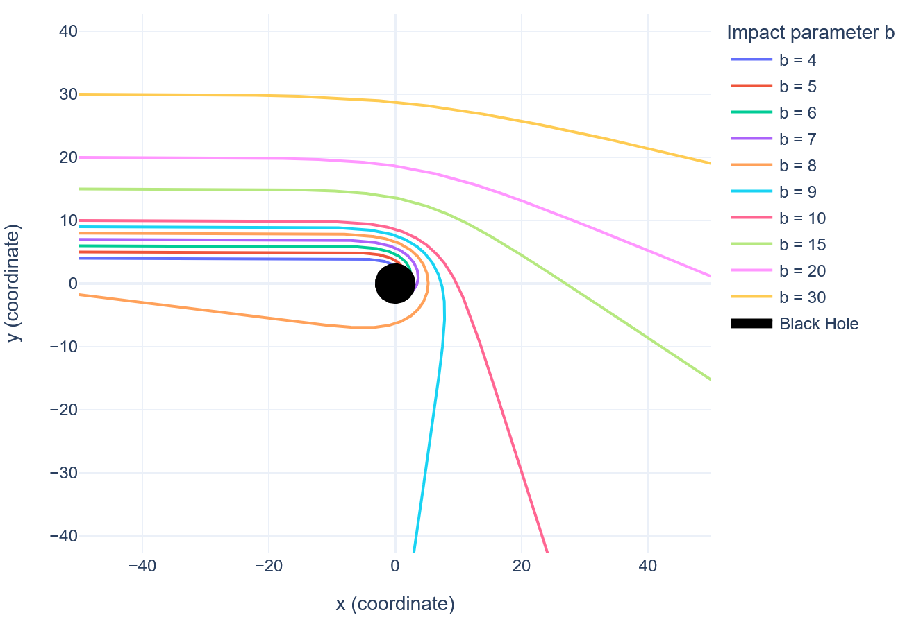
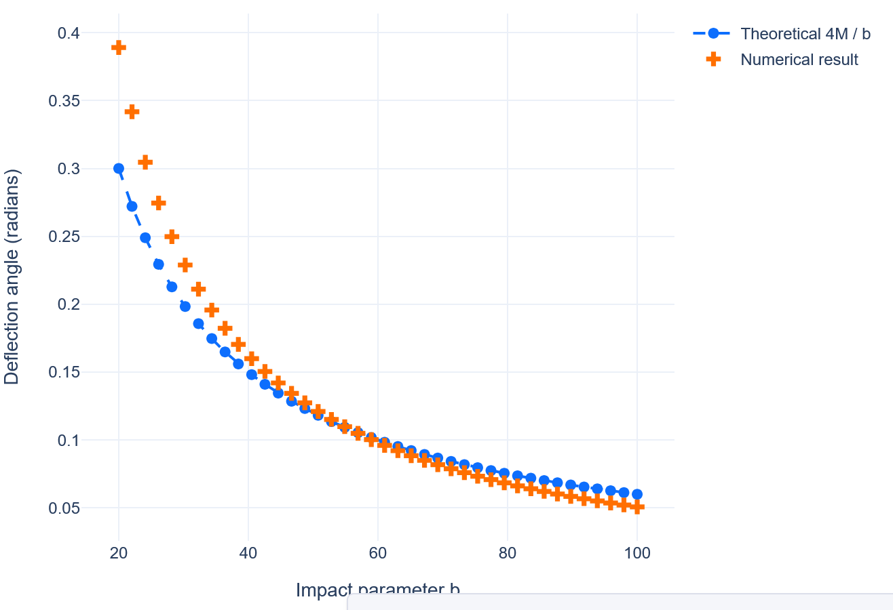

# Schwarzschild Light-Bending Explorer 🕳️➡️💡
Interactive Dash applications that **numerically integrate null geodesics in the Schwarzschild metric**. Two complementary dashboards let you

* watch photon trajectories curve (or plunge) around a non-rotating black hole;  
* compare the exact numerical deflection angle with the theoretical weak-field formula  
* choose the numerical integration method used for solving the differential equations via the `config.json` file

You can switch between the following ODE solvers:

* `solve_ivp` (SciPy's RK45 by default)
* `rk4` (Runge-Kutta 4th-order)
* `euler` (explicit Euler method)

Just edit the `"method"` field in `config.json` to use a different solver.

**2D Dashboard:** Classic top‑down view; photon paths bend in the  plane & compare to the weak‑field formula.

**3D Dashboard:** Full three‑dimensional visualisation; light‑ray planes can be tilted by an inclination slider so you can orbit the scene and appreciate genuine spatial curvature.

Developed for a Computer Simulation classes and documented in the accompanying report (`report.pdf`).

---

## ✨ Demo 2D

| Photon bundle (moderate *b*) | Deflection curve (weak-field range) |
| :--------------------------- | :---------------------------------- |
|  |  |

*(Screenshots taken at \(M = 1.5\); black disk marks the horizon \(r = 2M\))*

---

